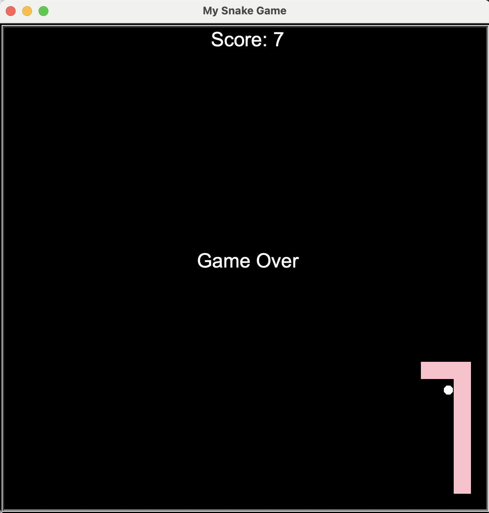

# Snake Game (Python)

A classic Snake game built with Python using the `turtle` graphics module.  
The focus of this project is clean object-oriented design, collision detection, and real-time user input.

---

## Gameplay
- Control the snake using the arrow keys
- Eat food to grow longer and increase your score
- Avoid colliding with the walls or the snake’s own body
- The game ends when a collision occurs

---

## Technical Skills
- Object-oriented programming in Python
- Event handling and user input
- Real-time game loops
- Collision detection logic
- Modular code structure (classes for Snake, Food, Scoreboard)
- Built-in Python modules: `turtle`, `time`, `random`

---

## Output Preview 


---

## Project Structure
- main.py # Game loop and event handling
- snake.py # Snake class and movement logic
- food.py # Food generation and repositioning
- scoreboard.py # Score tracking and game-over display

---

## How to run the game:
1. Ensure Python 3 is installed
2. Clone this repository:
   ```bash
   git clone https://github.com/your-username/snake-game.git
   ```
3. Run the game:
    ```bash
   python main.py
   ```
4. Use the arrow keys to control the snake and play.
